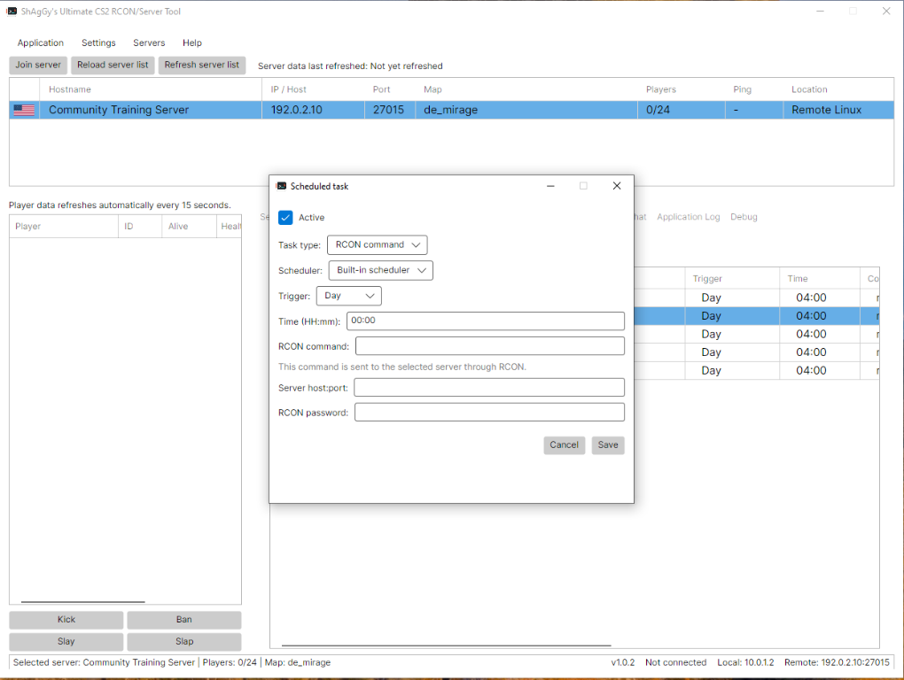
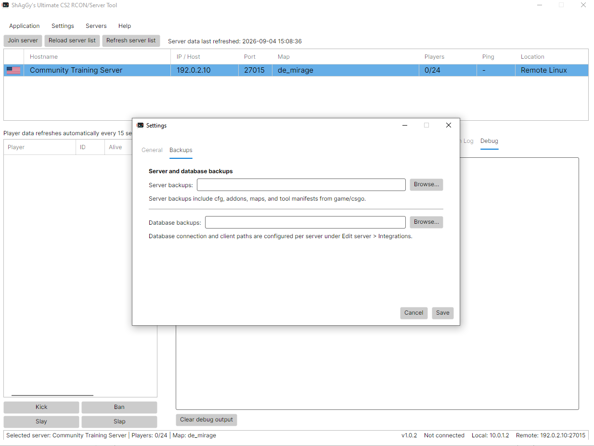
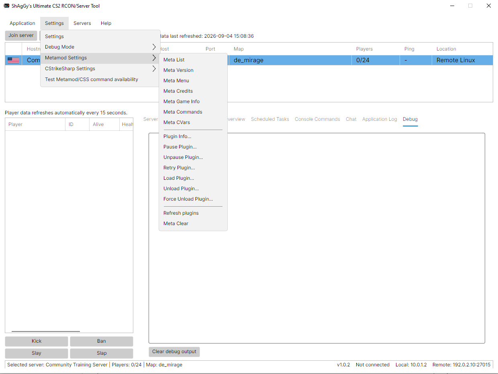
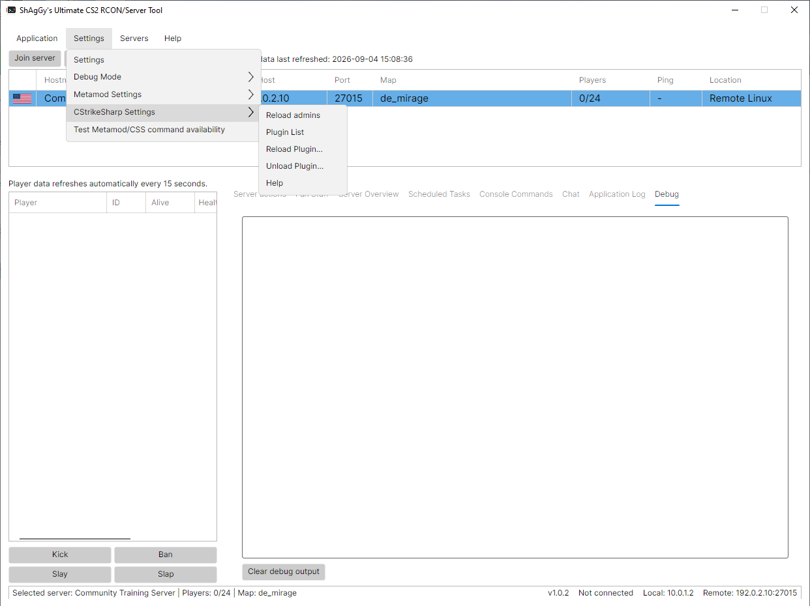

# Ultimate CS2 RCON and Server Management Tool - Linux Guide

Version: 1.0.4

This self-contained guide covers the Linux x64 application, Local Linux servers, and Remote Linux or Remote Windows servers. [README.md](README.md) provides the project-wide GitHub overview.

## Issues

Report application issues at https://github.com/ShAgGy2035/Ultimate-RCON-Server-Tool/issues/new.

## Table of Content
- **Linux application**
  - [Install and launch](#install-and-launch)
  - [Update the application](#update-the-application)
  - [Configuration and data](#configuration-and-data)
   - [PlayerPunishments setup](#playerpunishments-setup)
- **Local Linux server**
  - [Choose a lifecycle mode](#choose-a-local-lifecycle-mode)
  - [Direct process](#local-linux-direct-process)
  - [Service commands](#local-linux-service-commands)
   - [Finish Local Linux setup](#finish-local-linux-setup)
- **Remote Linux server**
  - [Requirements](#remote-linux-requirements)
   - [Account and permissions](#remote-linux-account-and-permissions)
  - [Direct process](#remote-linux-direct-process)
  - [Service commands with systemd](#linux-service-commands-with-systemd)
   - [Finish Remote Linux setup](#finish-remote-linux-setup)
- **Remote Windows server**
   - [Requirements](#remote-windows-requirements)
   - [Direct process](#remote-windows-direct-process)
   - [Service commands with WinSW](#remote-windows-service-commands-with-winsw)
- [SteamCMD behavior](#steamcmd-behavior)
- [Using the application](#using-the-application)
- [RCON Tool Companion and Fun Stuff](#rcon-tool-companion-and-fun-stuff)
- [ChatRelay](#chatrelay)
- [Frameworks and plugins](#frameworks-and-plugins)
- [Backups, data, and security](#backups-data-and-security)
- [Troubleshooting](#troubleshooting)
- [Application Screenshots](#application-screenshots)

## Install And Launch

Extract the Linux package and open its directory:

```bash
tar -xzf cs2-rcon-tool-universal-v1.0.4-linux-x64.tar.gz
cd cs2-rcon-tool-universal-v1.0.4-linux-x64
```

Launch through the included script:

```bash
./run.sh
```

Alternatively, open the extracted directory in your Linux file manager, right-click `run.sh`, and select **Run as a Program**. If that option is unavailable, open the file's **Properties > Permissions**, enable execution as a program, and try again.

Use `./run.sh --foreground` to keep the process attached for troubleshooting.

The package is self-contained and does not require a separate .NET installation. The launcher uses an app-local `.net` directory for extracted native single-file libraries. It is a cache and can be deleted while the application is closed.

## Update The Application

Close the application, then either replace the existing application files with the contents of the new TAR.GZ or extract the new version to a new folder. The archive preserves executable permissions.

Writable settings are stored under `~/.config/CS2RconTool` in a typical Linux environment, not beside the executable. Back up that entire directory, including `credential.key`, before updating. Do not replace or delete it while updating application files.

## Configuration And Data

Open **Settings > Settings** for application-wide GeoLite, flag, slap-damage, refresh, output-filtering, and backup-directory options. Configure lifecycle, SteamCMD, RCON, database, ChatRelay, and Steam authentication values per server under **Servers > Manage servers > Edit server**.

The Linux data directory contains server profiles, scheduled tasks, application settings, protected credentials, Fun Stuff state, GeoLite data, and flags:

```text
~/.config/CS2RconTool
```

Saved secrets use AES-256-GCM. Keep `credential.key` with the JSON files when backing up or migrating data.

### PlayerPunishments Setup

The app's Slay and Slap controls send `css_slay #userid` and `css_slap #userid damage`. Install [PlayerPunishments 1.0.0 or newer](https://github.com/ShAgGy2035/PlayerPunishments) on each managed CS2 server when its existing administration package does not provide those commands. Configure Slap damage from `0` to `99` under **Settings > General**.

PlayerPunishments is a CounterStrikeSharp server plugin. Install it in the Linux CS2 server's CounterStrikeSharp plugin directory, not in the desktop application's folder. Alive and Health display **Unknown** when the required server-side player-information command is unavailable.

## Local Linux Server

Use a **Local Linux** profile only when the application and CS2 server run on the same Linux computer.

Configure the CS2 install directory, executable, working directory, SteamCMD path, App ID `730`, startup map, game type, game mode, maximum players, tickrate, VAC state, LAN mode, Startup CFG, and optional player password. Startup can use a local map, Workshop collection, or single Workshop map. The editable map field suggests Valve maps, including Premier maps, while accepting custom names. Public internet servers can also use a Steam Web API key and game-server login token. These credentials are not required or prompted for when **LAN server** is enabled.

### Choose A Local Lifecycle Mode

- **Direct process**: the application builds the CS2 launch command and owns the process.
- **Service commands**: an existing systemd service owns CS2 and the application runs configured shell commands.

Stop the current owner before switching modes. systemd cannot adopt a CS2 process that was already launched directly.

### Local Linux Direct Process

Use this mode when the application should launch and stop the executable itself.

Typical values:

```text
Executable:        <install-dir>/game/bin/linuxsteamrt64/cs2
Working directory: <install-dir>/game
Arguments:         -dedicated +ip 0.0.0.0
```

The application adds authoritative map, game type, game mode, CFG, port, hostname, RCON, tickrate, VAC, LAN, Steam API, GSLT, and optional player-password arguments. An ordinary Start runs SteamCMD validation when SteamCMD and install-directory settings are configured. Restart does not run SteamCMD validation.

On supported Linux systems, the application can check SteamCMD prerequisites and bootstrap SteamCMD. Local profiles can also enable startup maintenance to warn players, stop CS2, update the server and supported add-ons, and restart it.

Local Linux Start and Restart show initial process output only through the startup check, then stop forwarding continuous CS2 runtime output. Explicit Local Linux console-fallback commands temporarily reopen output capture for their response.

### Local Linux Service Commands

Use this mode when an existing systemd service should own CS2. The application does not create the unit or sudoers policy.

Default commands target `cs2-server`:

```bash
sudo -n systemctl start cs2-server
sudo -n systemctl stop cs2-server
sudo -n systemctl restart cs2-server
```

The account running the application needs noninteractive sudo permission for these commands. Put all launch arguments, including `-tickrate`, `+sv_lan`, and `-secure` or `-insecure`, in the systemd launcher. Service Start and Restart do not run SteamCMD validation.

Use the complete setup under [Linux Service Commands With systemd](#linux-service-commands-with-systemd). For a local profile, replace `<ssh-user>` in its sudoers example with the desktop account running the application.

### Finish Local Linux Setup

After the Local Linux profile is configured:

1. Save the server profile.
2. Select the server in the top server list.
3. Right-click the server and select **Install/Update server...** to install or validate CS2 with SteamCMD.
4. If you also need the supported frameworks and tracked plugins maintained, select **Install/Update Server + Add-ons** instead.
5. Wait for the operation to finish and review **Console Commands**, **Application Log**, or **Debug** before selecting **Start**.

## Remote Linux Server

Use a **Remote Linux** profile when CS2 runs on another Linux computer.

### Remote Linux Requirements

Configure:

- SSH host, port, username, and password.
- Optional SFTP address, username, password, and port. Blank values reuse SSH details; port `0` reuses the SSH port. Valid SFTP ports range through `65535`.
- Remote SteamCMD path and CS2 installation directory for managed updates.
- App ID `730` and Steam login, normally `anonymous`.
- The lifecycle mode and its corresponding fields.

The remote account must run lifecycle commands and write to the installation directory. Remote browsing and file operations require SFTP access.

Remote Linux profiles reject Windows drive paths before SteamCMD starts. When a profile is changed from Remote Windows to Remote Linux, stale auto-generated executable and working-directory defaults are replaced with Linux defaults; explicitly configured valid custom paths remain editable.

### Remote Linux Account And Permissions

Prepare the remote accounts before configuring the application profile. The **SSH control account** is the username entered in the profile; it runs lifecycle commands and performs SFTP browsing, file transfers, plugin operations, backups, and SteamCMD operations. The **service account** owns and runs CS2 when using Service commands with systemd. These can be the same account, or they can be separate accounts.

The simplest setup uses the Linux account that owns the CS2 installation for both SSH and SFTP. If a dedicated SSH account does not already exist, create it as an administrator on the remote host and grant it SSH access:

```bash
sudo adduser <ssh-user>
sudo passwd <ssh-user>
```

Do not use `root` as the application, SteamCMD, or CS2 account. The SSH control account must be able to traverse every parent directory and read and write the CS2 installation. If it differs from the service account, grant access through a shared group or filesystem ACL rather than making the installation world-writable.

If the systemd service account does not already exist, create it before installing or assigning ownership of the CS2 files. It may be the same account as `<ssh-user>`:

```bash
sudo adduser <service-user>
```

Verify access before saving the application profile. Replace the placeholders with the configured account and install directory:

```bash
namei -l "<install-dir>/game/csgo"
sudo -u <ssh-user> test -r "<install-dir>/game/csgo/gameinfo.gi"
sudo -u <ssh-user> touch "<install-dir>/game/csgo/.rcon-tool-write-test"
sudo -u <ssh-user> rm "<install-dir>/game/csgo/.rcon-tool-write-test"
```

One ACL example is:

```bash
sudo setfacl -m u:<ssh-user>:x "<parent-directory>"
sudo setfacl -R -m u:<ssh-user>:rwX "<install-dir>"
sudo setfacl -R -d -m u:<ssh-user>:rwX "<install-dir>"
```

The first command-line SSH connection may ask you to trust the host fingerprint. The application uses its own SSH library and does not depend on the command-line client's `known_hosts` entry.

### Remote Linux Direct Process

Direct process mode runs CS2 without a systemd service. It is appropriate when the SSH account owns the installation and the application should manage the executable.

1. Select **Remote Linux (SSH)** and set **Startup mode** to **Direct process**.
2. Enter the install directory, for example `/home/cs2/cs2server`. Blank fields derive:

   ```text
   Executable:  /home/cs2/cs2server/game/bin/linuxsteamrt64/cs2
   Working dir: /home/cs2/cs2server/game
   ```

3. Set the startup map, game type, and game mode. Put only optional switches in **Additional arguments**. The application supplies `-dedicated`, `-console`, port, hostname, `+map`, `+game_type`, `+game_mode`, `+exec`, `-usercon`, RCON password, tickrate, LAN mode, and VAC state. The default `+ip 0.0.0.0` permits remote connections.
4. Enter a path-specific Stop command. For the example above:

   ```bash
   executable='/home/cs2/cs2server/game/bin/linuxsteamrt64/cs2'; for process in /proc/[0-9]*; do target=$(readlink "$process/exe" 2>/dev/null || true); if [ "$target" = "$executable" ]; then kill -TERM "${process##*/}"; fi; done
   ```

5. Optionally enter the Steam API authentication key and GSLT. They are appended at launch and redacted from output.
6. Save the profile and use **Start**, **Stop**, or **Restart**.

Start refuses to run while SteamCMD is updating app `730`, verifies `game/csgo/gameinfo.gi`, supplies required Linux native-library paths, launches CS2 detached from SSH, and monitors it for 30 seconds. Startup output is captured in `/tmp/cs2-rcon-tool-startup-<port>.log`. Stop verifies that the exact executable exited.

Direct mode refuses to control an executable owned by the active `cs2-server` systemd cgroup. It does not start CS2 at boot or restart it after a crash.

### Linux Service Commands With systemd

Service commands mode requires an existing service. The application does not create privileged systemd or sudoers files. This pattern runs CS2 as the installation owner, supplies required native libraries, preserves crash exit codes for `Restart=on-failure`, and treats an explicit stop as clean.

Replace `<install-dir>`, `<service-home>`, `<service-user>`, `<service-group>`, `<ssh-user>`, hostname, map, and credentials.

Create a launcher named `cs2-rcon-tool-start`:

```bash
#!/usr/bin/env bash
export HOME="<service-home>"
export LD_LIBRARY_PATH="<install-dir>/game/bin/linuxsteamrt64:<install-dir>/game/csgo/bin/linuxsteamrt64:<install-dir>/.steam/sdk64:<install-dir>/steamcmd/linux64${LD_LIBRARY_PATH:+:$LD_LIBRARY_PATH}"
cd "<install-dir>/game"

"<install-dir>/game/bin/linuxsteamrt64/cs2" \
   -dedicated +ip 0.0.0.0 -high -nobreakpad -nomemorystats -nojoy \
   +sv_hibernate_when_empty 0 +map de_dust2 +game_type 0 +game_mode 1 \
   +exec server.cfg -console -port 27015 -tickrate 64 -secure +sv_lan 0 \
   +hostname "CS2 Server" -usercon +rcon_password "<rcon-password>" &
child=$!

shutdown() {
   kill -TERM "$child" 2>/dev/null || true
   wait "$child" 2>/dev/null || true
   exit 0
}

trap shutdown TERM INT
wait "$child"
exit $?
```

Create `cs2-server.service`:

```ini
[Unit]
Description=Counter-Strike 2 Dedicated Server
After=network-online.target
Wants=network-online.target
StartLimitIntervalSec=300
StartLimitBurst=5

[Service]
Type=simple
User=<service-user>
Group=<service-group>
ExecStart=/usr/local/libexec/cs2-rcon-tool-start
Restart=on-failure
RestartSec=5
TimeoutStopSec=30
KillSignal=SIGTERM
KillMode=mixed

[Install]
WantedBy=multi-user.target
```

Create `cs2-rcon-tool.sudoers` containing only the required lifecycle commands:

```sudoers
<ssh-user> ALL=(root) NOPASSWD: /usr/bin/systemctl start cs2-server, /usr/bin/systemctl stop cs2-server, /usr/bin/systemctl restart cs2-server, /usr/bin/systemctl status cs2-server, /usr/bin/systemctl is-active cs2-server
```

Install and validate from an administrator terminal. `<service-home>` must be the service account's real home, such as `/home/cs2`, not the CS2 installation directory. The launcher contains the RCON password, so restrict it to root and the service account's group.

```bash
sudo install -d -o root -g root -m 755 /usr/local/libexec
sudo install -o root -g <service-group> -m 750 ./cs2-rcon-tool-start /usr/local/libexec/cs2-rcon-tool-start
sudo install -o root -g root -m 644 ./cs2-server.service /etc/systemd/system/cs2-server.service
sudo visudo -cf ./cs2-rcon-tool.sudoers
sudo install -o root -g root -m 440 ./cs2-rcon-tool.sudoers /etc/sudoers.d/cs2-rcon-tool
sudo systemctl daemon-reload
sudo systemctl enable cs2-server.service
```

Configure a Remote Linux profile:

```text
Startup mode: Service commands
Start:   sudo -n systemctl start cs2-server
Stop:    sudo -n systemctl stop cs2-server
Restart: sudo -n systemctl restart cs2-server
Remote install directory: <install-dir>
```

For Local Linux, use the same lifecycle commands and configure the local install directory. Service launch arguments belong in the launcher, not in Direct-process fields.

Remote Service Start and Restart perform a SteamCMD/core-file preflight, resolve the expected executable, and require the service-owned process to remain alive for 30 seconds. Verification uses the exact executable when readable and otherwise requires a `cs2` process in the configured unit's exact cgroup. Stop requires the process to disappear.

### Finish Remote Linux Setup

After the Remote Linux profile and its Direct process or Service commands setup are complete:

1. Save the server profile.
2. Select the server in the top server list.
3. Right-click the server and select **Install/Update server...** to install or validate CS2 with SteamCMD.
4. If you also need the supported frameworks and tracked plugins maintained, select **Install/Update Server + Add-ons** instead.
5. Wait for the operation to finish and review **Console Commands**, **Application Log**, or **Debug** before selecting **Start**. For Service commands, the configured systemd service remains the process owner when the app starts it.

## Remote Windows Server

Use a **Remote Windows** profile to manage a CS2 server on another Windows computer from the Linux application. Remote Windows management uses SSH and does not require WinRM.

### Remote Windows Requirements

- OpenSSH server access to the Windows computer.
- An SSH account in the remote computer's local Administrators group for WMI process creation and firewall configuration.
- Optional SFTP details for browsing and general transfers. Blank values reuse SSH details; port `0` reuses the SSH port. Valid ports range through `65535`.
- A Windows SteamCMD path and CS2 installation directory for managed updates.

Remote Windows plugin deployment and Direct-process startup do not require a separate SFTP service. Windows drive paths are required; Unix paths are rejected before SteamCMD starts. Switching a profile from Remote Linux replaces stale auto-generated executable and working-directory defaults with Windows defaults.

### Remote Windows Direct Process

Use this mode when the application should launch CS2 over SSH without a Windows service wrapper. For `C:\cs2server`, blank fields derive:

```text
Executable:        C:\cs2server\game\bin\win64\cs2.exe
Working directory: C:\cs2server\game
SteamCMD path:     C:\cs2server-steamcmd\steamcmd.exe
```

Configure the startup map, game type, game mode, additional arguments, and Stop command. The application supplies `-dedicated`, `-console`, `+ip 0.0.0.0`, port, hostname, map, game type, game mode, Startup CFG, RCON password, tickrate, LAN mode, and VAC state. Optional Steam API and GSLT values are appended and redacted from output.

Start transfers a temporary PowerShell launcher over SSH, starts CS2 through WMI independently of the SSH session, creates inbound UDP and TCP firewall rules, captures startup output, and monitors the process for 30 seconds. Restart runs Stop and then launches a new process. Direct mode refuses to control an executable owned by the active `cs2-server` service. It does not provide boot startup or automatic crash restart.

### Remote Windows Service Commands With WinSW

Windows service mode requires a wrapper because `cs2.exe` does not implement the Windows Service Control Manager protocol. This example uses [WinSW](https://github.com/winsw/winsw) and service name `cs2-server`. Run it once in an Administrator PowerShell terminal on the Windows server after stopping any Direct-process instance.

```powershell
$ErrorActionPreference = 'Stop'
$ProgressPreference = 'SilentlyContinue'
New-Item -ItemType Directory -Force -Path C:\Services\cs2-server | Out-Null
Invoke-WebRequest `
    -Uri 'https://github.com/winsw/winsw/releases/download/v2.12.0/WinSW-x64.exe' `
    -OutFile 'C:\Services\cs2-server\cs2-server.exe'
```

Create `C:\Services\cs2-server\cs2-server.xml`, replacing the sample hostname, map, passwords, Steam API key, and GSLT. XML-escape `&`, `<`, and `>` in values.

```xml
<service>
   <id>cs2-server</id>
   <name>CS2 Dedicated Server</name>
   <description>Counter-Strike 2 Dedicated Server managed by CS2 RCON Tool</description>
   <executable>C:\cs2server\game\bin\win64\cs2.exe</executable>
   <arguments>-dedicated -console -usercon -port 27015 -tickrate 64 -secure +ip 0.0.0.0 +sv_lan 0 +map de_dust2 +game_type 0 +game_mode 1 +exec server.cfg +hostname "CS2 Server" +rcon_password "&lt;rcon-password&gt;" -authkey "&lt;steam-api-key&gt;" +sv_setsteamaccount "&lt;gslt&gt;"</arguments>
   <workingdirectory>C:\cs2server\game</workingdirectory>
   <env name="SteamAppId" value="730" />
   <env name="SteamGameId" value="730" />
   <startmode>Automatic</startmode>
   <stoptimeout>30 sec</stoptimeout>
   <onfailure action="restart" delay="10 sec" />
   <logpath>C:\cs2server\logs</logpath>
   <log mode="roll-by-size">
      <sizeThreshold>10240</sizeThreshold>
      <keepFiles>8</keepFiles>
   </log>
</service>
```

Install the wrapper, create firewall rules, and start the service:

```powershell
New-Item -ItemType Directory -Force -Path C:\cs2server\logs | Out-Null
Set-Location C:\Services\cs2-server
.\cs2-server.exe install
New-NetFirewallRule -DisplayName 'CS2 RCON Tool UDP 27015' -Direction Inbound -Action Allow -Protocol UDP -LocalPort 27015 -Program 'C:\cs2server\game\bin\win64\cs2.exe' -Profile Any
New-NetFirewallRule -DisplayName 'CS2 RCON Tool TCP 27015' -Direction Inbound -Action Allow -Protocol TCP -LocalPort 27015 -Program 'C:\cs2server\game\bin\win64\cs2.exe' -Profile Any
Start-Service -Name 'cs2-server'
Get-Service -Name 'cs2-server'
Get-Process -Name 'cs2'
```

Configure the profile:

```text
Startup mode: Service commands
Start:   powershell -NoProfile -NonInteractive -Command "Start-Service -Name 'cs2-server'"
Stop:    powershell -NoProfile -NonInteractive -Command "Stop-Service -Name 'cs2-server'"
Restart: powershell -NoProfile -NonInteractive -Command "Restart-Service -Name 'cs2-server'"
```

All launch arguments belong in the WinSW XML. WinSW writes rolled output and error logs under `C:\cs2server\logs` and restarts CS2 after an unexpected exit.

## SteamCMD Behavior

| Linux profile and mode | Start | Restart |
| --- | --- | --- |
| Local Linux, Direct process | Runs validation when SteamCMD and install-directory settings are configured | Does not run validation |
| Local Linux, Service commands | Runs the configured Start command without validation | Runs the configured Restart command without validation |
| Remote Linux, Direct process | Checks launch ownership and monitors startup without validation | Stops and starts without validation |
| Remote Linux, Service commands | Checks SteamCMD is idle, verifies the core file, and monitors the service process without validation | Performs the same preflight and monitoring without validation |

Use **Validate server files** or **Install/Update Server** for explicit SteamCMD validation.

### SteamCMD Linux Prerequisites

SteamCMD is a 32-bit Linux binary. This guide covers 64-bit Ubuntu and Debian systems, where SteamCMD requires the `i386` architecture and these 32-bit runtime packages before downloading or running SteamCMD:

```text
i386 architecture
libc6-i386
lib32gcc-s1
lib32stdc++6
```

When any Ubuntu prerequisite is missing, the application asks for desktop administrator authorization before installing it. On Debian, or when automatic installation is unavailable, install the packages manually with:

```bash
sudo dpkg --add-architecture i386
sudo apt update
sudo apt install -y libc6-i386 lib32gcc-s1 lib32stdc++6
```

Do not run SteamCMD or the CS2 server as `root`. Run the application and SteamCMD under the normal account that owns the SteamCMD and CS2 installation directories, and grant that account only the filesystem and service permissions it needs.

On first launch, SteamCMD updates its own files before accepting commands. The application performs that bootstrap and uses anonymous Steam login by default for CS2 App ID `730`. SteamCMD runs through the application, and its progress and output are captured in **Console Commands**, **Application Log**, and **Debug** tabs so users can monitor installation and validation without a separate interactive terminal.

These are operating-system packages for SteamCMD, not CS2 server plugins. Metamod, CounterStrikeSharp, MenuManagerAPI, RCON Tool Companion, ChatRelay, and other add-ons are installed separately on the managed CS2 server as described in [Frameworks And Plugins](#frameworks-and-plugins) and [RCON Tool Companion And Fun Stuff](#rcon-tool-companion-and-fun-stuff).

When a managed local CS2 process is running, the application pauses before SteamCMD and offers to stop it and continue. Cancelling leaves the server running and aborts the update or validation. After SteamCMD restores core files, **Install/Update Server** reapplies and validates the Metamod/CounterStrikeSharp loader chain. **Install/Update Server + Add-ons** combines the core update with framework and tracked-plugin maintenance.

## Using The Application

### Connect And Refresh

1. Open **Servers > Manage servers**.
2. Add a server and enter its name, host/IP, game/RCON port, RCON password, and location.
3. Complete lifecycle and SteamCMD fields when the application will manage those operations.
4. Configure Workshop, database, and ChatRelay integration values when used.
5. Save the profile, select it in the top server list, and click **Refresh server list**.

RCON uses TCP. Opening only the UDP game port is not sufficient. The top list displays hostname, address, port, map, players, ping, location, and country. **Reload server list** reads saved profiles without contacting servers; **Refresh server list** queries live A2S information.

Deleting a server requires confirmation. Optional app-state cleanup removes that profile's scheduled tasks, external scheduler entries, console history, and cached state. It does not delete CS2 installations, plugins, backups, or managed-server files.

### Server Actions And Joining

Server Actions controls hostname, bots, teams, passwords, friendly fire, cheats, pause, maps, maximum rounds, timed restarts, and kick/ban/slay/slap operations. These are runtime commands and never edit server CFG files. Values in a Startup CFG can replace runtime changes when a map executes it.

Select a server and click **Join server**. Linux tries Steam and available desktop URI handlers. If Steam opens CS2 without connecting, enable the developer console, press `~`, and paste the copied `connect IP:port` command.

### Settings

Open **Settings > Settings**. The **General** tab contains GeoLite and flag URLs, Slap damage from `0` to `99`, automatic 15-second server-list refresh, noisy-output filtering, and **Update GeoLite + flags**. The **Backups** tab provides separate server-file and database backup destinations.

Server-specific lifecycle, SteamCMD, map, Workshop, RCON, player-password, database, ChatRelay, Steam authentication, and backup credentials remain under **Servers > Manage servers > Edit server**. Protected values are encrypted before storage.

### Console, Logs, And Debug

Console Commands accepts free-form RCON commands and categorized suggestions. Each server has separate bounded history, and process, SteamCMD, SSH, and RCON output remains associated with its originating server. Application Log reports normal operations and failures; Debug provides detailed diagnostics. Passwords, credentials, API keys, and tokens are redacted even in Debug Mode and raw output.

When closing with Debug Mode enabled, choose **Stop debugging** to disable it and return to the application or **Exit program** to close anyway.

### Scheduled Tasks

Task types include RCON commands, framework/plugin maintenance, server backups, database backups, and GeoLite/flag updates. Triggers include Day, Hour, and Startup. The built-in scheduler runs while the application is open and monitoring is active. Native Linux tasks use systemd user timers and invoke the headless task runner, so the GUI does not need to remain open.

## RCON Tool Companion And Fun Stuff

All Fun Stuff modes require the current [RCON Tool Companion 1.0.1 build](https://github.com/ShAgGy2035/RconCompanionTool). The plugin targets CounterStrikeSharp API 1.0.374 and supports `v1.0.374-khs-khook`. Install the complete MenuManagerAPI 1.0.3 release first; RCT requires its `MenuManagerAPI.Shared.dll` contract during registration and its `menu:api` capability for WASD navigation. Without it, CounterStrikeSharp reports RCT as unregistered and its commands are unavailable.

Modes include AWP/Sniper Wars, Bhop, Deathmatch, Grenade Wars, Molotov/Incendiary Wars, Headshot Only, Knife Arena, Pistols Only, ScoutzKnives, Surf, and Zeus Wars. Administrators with `@css/fun` can use `!fun` or `/fun` in game without the RCON password.

Every mode includes **Enable bots**, an optional quota from 1 to 64, and `normal`, `fill`, or `match` quota modes. A blank enabled quota preserves the existing value; disabling bots removes them and holds the quota at zero until rollback or a mode switch restores the captured quota and mode.

The application captures affected cvars before applying a mode. Switching restores the previous mode first; **None (rollback)** restores exact captured values without editing or executing a CFG. Each mode activates an isolated Companion profile, and a shared server-side lock rejects overlapping apply and rollback attempts. Companion maintains player-aware inventories across spawns and bot takeovers while preserving the Terrorist bomb carrier's C4. Managed-weapon modes clean dropped and map-placed weapons; Headshot Only deliberately leaves weapons and buying unchanged.

ScoutzKnives manages SSG 08 plus team knife and exposes air acceleration, gravity, fall damage, friction, and bunnyhop controls. AWP/Sniper Wars manages AWP-only inventories. Pistols, Knife, Zeus, HE-grenade, and fire-grenade modes retain dedicated loadouts. Surf exposes acceleration, air acceleration, gravity, stamina, round-time, freeze-time, cheats, and bunnyhop controls. Values are also available in standalone `RCT.json`.

Deathmatch stages duration, respawn, and random-spawn behavior before map initialization. Leaving Deathmatch reloads the current map because CS2 only fully exits its built-in Deathmatch mode on a map load; other rollbacks and switches restart the round. Companion stores one authoritative pre-mode snapshot under `configs/plugins/RCT`, allowing Universal or `!fun` to roll back a mode applied by either interface.

## ChatRelay

ChatRelay is a separate [CounterStrikeSharp plugin](https://github.com/ShAgGy2035/ChatRelay); its binaries are not bundled with this application.

1. Install and configure ChatRelay on the CS2 server using its repository instructions.
2. In the Chat tab, select the receiving network adapter and UDP port; the default is `9090`.
3. Set a unique high-entropy token under **Edit server > Integrations**.
4. Use **Copy ChatRelay target JSON** to create the matching `TargetIp`, `TargetPort`, and `SharedToken` entry.
5. Use the local authenticated **Test** action and send admin chat through RCON as needed.

The listener accepts authenticated JSON only, limits datagrams to 8 KiB, and drops rejected packets. UDP does not encrypt traffic or prove the sender's network address. Restrict firewall access to the game server or trusted LAN, or use a VPN rather than exposing it directly to the internet.

## Frameworks And Plugins

Install Metamod before CounterStrikeSharp. Interactive installation shows the latest 20 compatible releases and accepts a selected release or direct HTTP(S) ZIP, TAR.GZ, or TGZ URL. Scheduled and headless maintenance use the newest compatible releases because they cannot display selection dialogs.

Under **Settings > Metamod Settings**, list plugins and run info, pause, unpause, retry, load, unload, or force-unload operations. Under **Settings > CStrikeSharp Settings**, reload admins and list, reload, or unload plugins. **Settings > Test Metamod/CSS command availability** probes safe command forms with nonexistent plugin IDs.

Optional plugins can come from GitHub, a public GitLab.com project including nested groups, or a supported local archive or library. Assets are filtered by server OS. When multiple packages match, the application asks which asset to install and remembers a version-independent filename preference. Installed files are tracked in `game/csgo/.cs2-rcon-tool-plugins.json`; keep this ownership manifest with the server so uninstall removes only owned files and preserves shared configuration and framework files.

Remote updates replace native binaries atomically rather than truncating loaded files. A running server keeps using the previous binary until restart, preventing memory-mapped library crashes. Local plugin batches stop CS2 once before replacing plugin/shared API assemblies and restart it without SteamCMD.

## Backups, Data, And Security

- **Backup server** archives configuration, add-ons, maps, `gameinfo.gi`, and plugin tracking rather than stock CS2 binaries or Workshop downloads.
- **Backup database** runs `mysqldump` with the selected server's integration settings.
- **Restore server backup...** accepts ZIP, TAR.GZ, or TGZ, validates it, stops CS2, restores supported content, and restarts it.
- **Install/update + restore server backup...** updates core files before restoring.
- **Restore database backup...** imports SQL with the configured MySQL client.
- **Validate server files** runs SteamCMD with `validate`.

Writable data is stored under `~/.config/CS2RconTool`, not beside the executable. It includes `servers.json`, `tasks.json`, `steam_settings.json`, `fun_stuff_state.json`, `credential.key`, GeoLite data, and flags. Saved secrets use AES-256-GCM. Protect and back up `credential.key` with the JSON files. Release archives exclude runtime settings, keys, caches, PDBs, ChatRelay binaries, and Companion binaries.

For migration, open the new application once and close it, back up the generated data directory, then copy the old JSON files and matching `credential.key`. Re-enter and save any credential that cannot be decrypted. Imported `Local Windows` profiles must be changed to `Local Linux` with Linux executable, SteamCMD, install, working-directory, and launch paths before they can be saved. Remote profiles remain usable with valid target paths and credentials.

## Troubleshooting

- Verify the executable, working directory, SteamCMD path, install directory, and profile OS.
- For a bridged virtual machine, use the guest's LAN address rather than the host address or `127.0.0.1`.
- Keep `+ip 0.0.0.0` in Direct-process arguments for remote access. Put it in the systemd launcher for Service commands mode.
- Verify listening sockets with `ss -lntup | grep 27015`, replacing the port as needed.
- `Connection refused` means no SSH service accepted the configured host and port.
- Authentication errors mean the SSH username or password was rejected.
- `Permission denied` after login usually means the account cannot traverse a parent directory or access the installation. Run the checks under [Remote Linux Account And Permissions](#remote-linux-account-and-permissions).
- Confirm lifecycle commands do not require an interactive privilege prompt.
- Remote archive operations require `tar` and either `unzip` or `python3` for ZIP files.
- Framework and SteamCMD downloads require `curl`, `wget`, or `python3`; the application uses the first available option. Remote SteamCMD bootstrap supports installation paths containing spaces.
- Remote SteamCMD validation opens **Console Commands** and streams output while it runs. Remote Stop and service-mode Restart also stream command output and retain explicit sent/completed milestones when a command produces no output.
- If a local server exits immediately, check Application Log and Debug for its exit code and stderr, verify executable, working directory, and launch arguments, and confirm required Linux runtime libraries and Steam client files are available.
- Linux framework installation handles the known executable-stack requirement on affected CounterStrikeSharp ELF libraries.
- The installer deploys Metamod's CS2 bridge as `addons/metamod/bin/linuxsteamrt64/libserver_valve.so`. If `Source2ServerConfig001` still fails, stop CS2, validate it with **Install/Update Server**, reinstall Metamod, and then start the server.
- If Chat does not appear, verify ChatRelay is running, match the destination IP, adapter, UDP port, and token, check firewall rules, and use the Chat tab's **Test** action.
- If country or flag data is missing, run **Settings > General > Update GeoLite + flags**, confirm the configured URLs are direct downloads, and verify the per-user data directory is writable.
- If a scheduled task does not run, confirm it is active and valid. Start monitoring for built-in tasks; inspect the systemd user timer for native tasks.
- Do not run Direct process and Service commands modes against the same executable and port.

## About

Open **Help > About** to view version `1.0.4`, developer information, and the detected application platform.

## Application Screenshots

| Server management | Integrations |
| --- | --- |
|  |  |
| Fun Stuff | Console commands |
|  |  |
| Scheduled tasks | Add scheduled task |
|  |  |
| Chat | Debug output |
|  |  |
| General settings | Backup settings |
|  |  |
| Metamod controls | CounterStrikeSharp controls |
|  |  |
