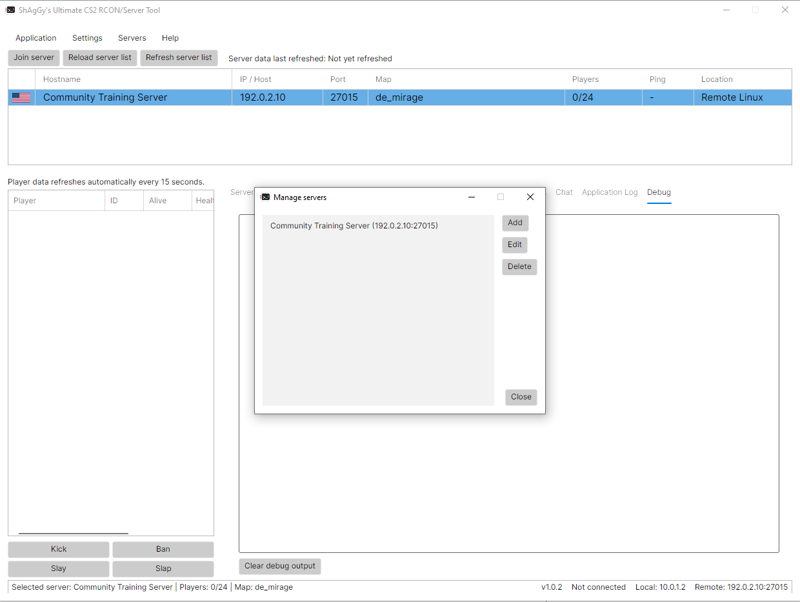
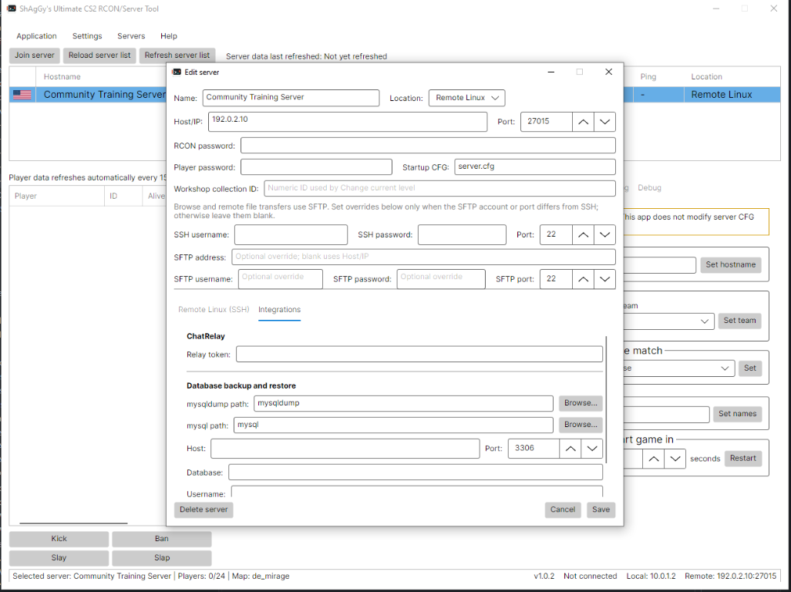
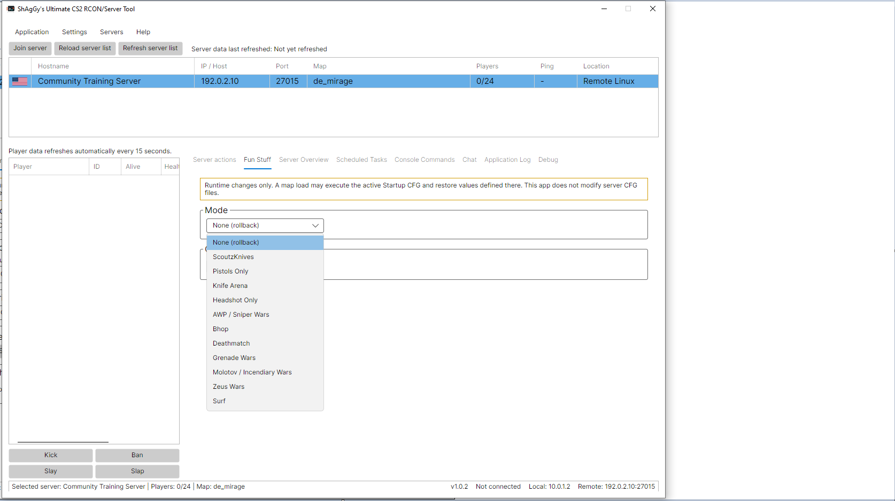
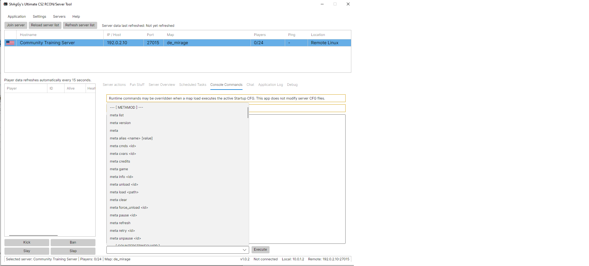
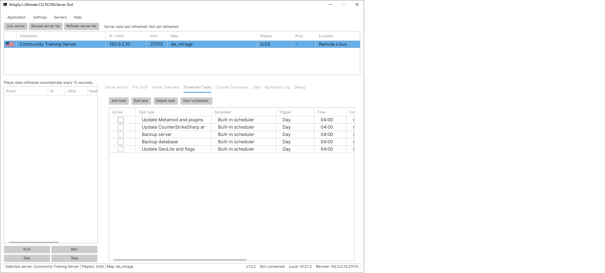
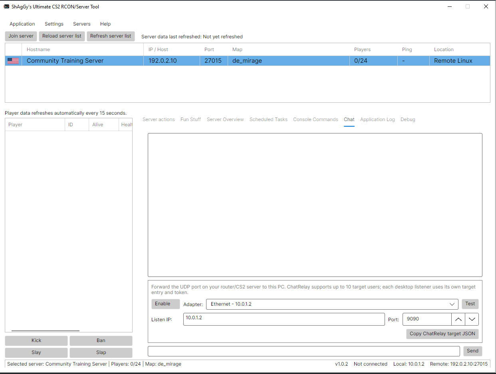
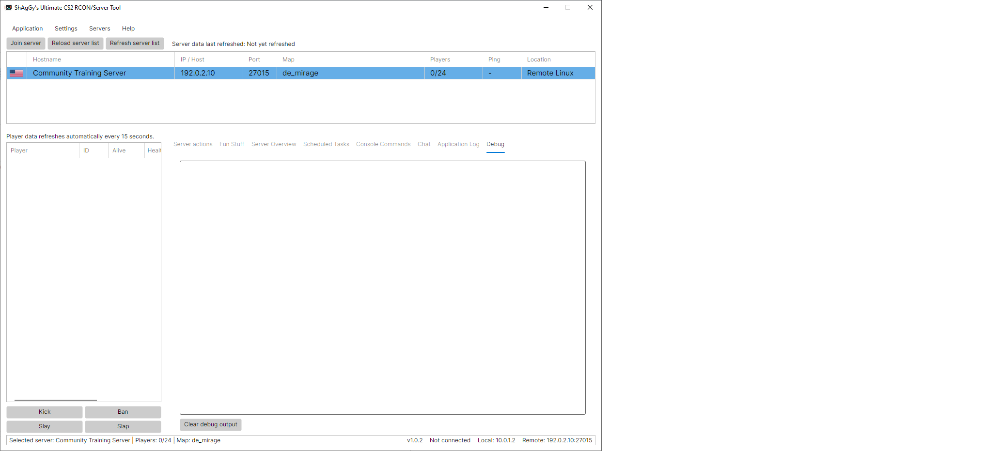
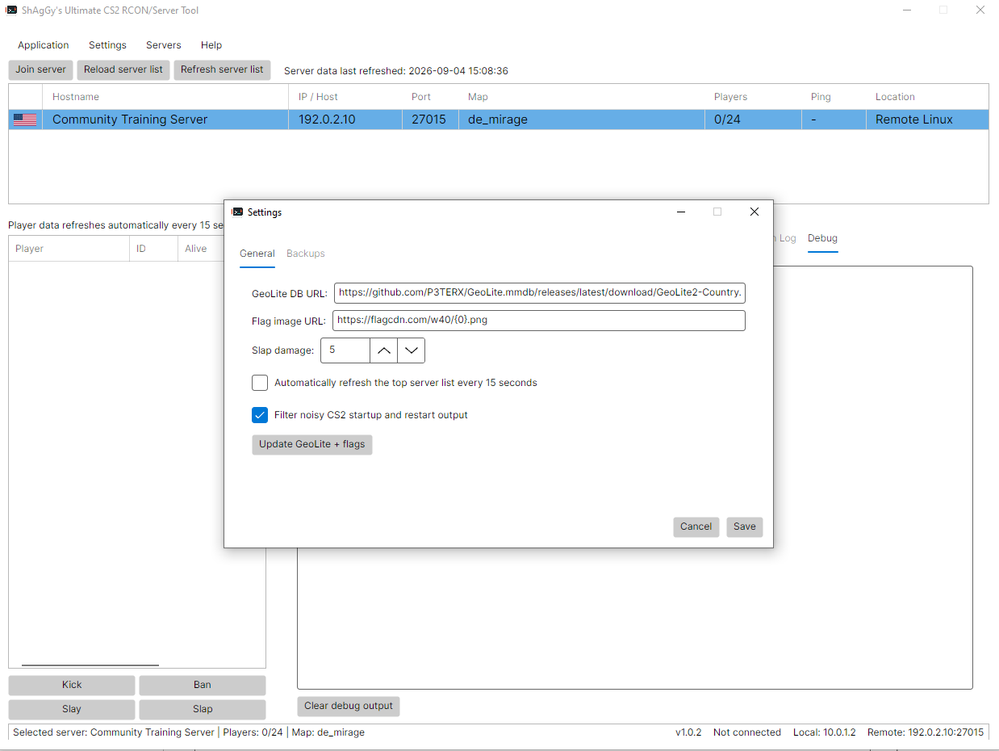

# Ultimate CS2 RCON and Server Management Tool - macOS Guide

Version: 1.0.4

This self-contained guide covers the macOS application packages and Remote Linux or Remote Windows server management. Valve does not publish a native macOS CS2 dedicated-server runtime, so macOS cannot use Local Linux or Local Windows profiles.

[README.md](README.md) provides the project-wide GitHub overview. This file contains all instructions needed for the macOS package.

## Issues

Report application issues at https://github.com/ShAgGy2035/Ultimate-RCON-Server-Tool/issues/new.

## Table of Contents

- [Requirements](#requirements)
- [Install And Launch](#install-and-launch)
- [Update The Application](#update-the-application)
- [Create A Remote Profile](#create-a-remote-profile)
- [Choose A Lifecycle Mode](#choose-a-lifecycle-mode)
- [Remote Linux Setup](#remote-linux-setup)
- [Remote Linux Account And Permissions](#remote-linux-account-and-permissions)
- [Finish Remote Linux Setup](#finish-remote-linux-setup)
- [Remote Windows Setup](#remote-windows-setup)
- [Create The Windows SSH User](#create-the-windows-ssh-user)
- [Finish Remote Windows Setup](#finish-remote-windows-setup)
- [Using The Application](#using-the-application)
- [RCON Tool Companion And Fun Stuff](#rcon-tool-companion-and-fun-stuff)
- [ChatRelay](#chatrelay)
- [PlayerPunishments](#playerpunishments)
- [Frameworks, Plugins, And Backups](#frameworks-plugins-and-backups)
	- [Install Optional CSS Plugins](#install-optional-css-plugins)
- [macOS Integration](#macos-integration)
- [Troubleshooting](#troubleshooting)
- [About](#about)
- [Application Screenshots](#application-screenshots)

## Requirements

- macOS 12.0 or later.
- The x64 package for an Intel Mac or the arm64 package for Apple Silicon.
- Network access from the Mac to the CS2 server's RCON TCP port.
- SSH access to the target computer for remote lifecycle, installation, and file operations.

## Install And Launch

Extract the matching package and open `CS2 RCON Tool.app`.

The packages are self-contained and do not require a separate .NET installation. They are currently unsigned and not notarized. If Gatekeeper quarantines a test build, open Terminal in the extracted directory and run:

```bash
xattr -dr com.apple.quarantine "CS2 RCON Tool.app"
chmod +x "CS2 RCON Tool.app/Contents/MacOS/cs2-rcon-tool"
open "CS2 RCON Tool.app"
```

## Update The Application

Close the application, extract the new package, and replace the entire `CS2 RCON Tool.app` bundle. Do not merge files inside the old bundle.

Writable settings are typically stored under:

```text
~/Library/Application Support/CS2RconTool
```

Back up that entire directory, including `credential.key`, before updating. Saved secrets use AES-256-GCM, so keep the key with the profile and settings JSON files during migration.

## Create A Remote Profile

1. Open **Servers > Manage servers**.
2. Add either **Remote Linux (SSH)** or **Remote Windows (SSH)** according to the target server's operating system.
3. Enter the SSH host, port, username, and password.
4. Enter optional separate SFTP details, or leave them blank to reuse the SSH connection.
5. Choose **Direct process** or **Service commands**.
6. Complete the lifecycle and SteamCMD settings described in the matching target-server guide.
7. Enter the server address, game/RCON port, and RCON password.
8. Save the profile and select it in the main server list.

Imported Local Linux or Local Windows profiles may be displayed, but local lifecycle and installation actions cannot run on macOS. Convert them to the correct Remote profile type and replace local paths with paths valid on the target server.

## Choose A Lifecycle Mode

### Direct Process

Choose Direct process when the application should start and stop the remote CS2 executable over SSH.

- Remote Linux setup: [Remote Linux Direct Process](#remote-linux-direct-process)
- Remote Windows setup: [Remote Windows Direct Process](#remote-windows-direct-process)

The application supplies the selected tickrate, VAC state, and LAN mode for Direct-process launches. Direct mode does not provide automatic startup at target-system boot or automatic restart after a crash.

### Service Commands

Choose Service commands when systemd or a Windows service wrapper already owns CS2.

- Remote Linux systemd setup: [Remote Linux Service Commands With systemd](#remote-linux-service-commands-with-systemd)
- Remote Windows WinSW setup: [Remote Windows Service Commands With WinSW](#remote-windows-service-commands-with-winsw)

The application executes configured Start, Stop, and Restart commands; it does not install the service. Put CS2 launch settings such as `-tickrate`, `+sv_lan`, and `-secure` or `-insecure` in the target service configuration.

Stop the current owner before switching lifecycle modes. Direct process and Service commands must not manage the same executable and port simultaneously.

## Remote Linux Setup

Configure SSH host, port, username, password, optional SFTP details, SteamCMD path, install directory, App ID `730`, and login, normally `anonymous`. Blank SFTP values reuse SSH details; port `0` reuses the SSH port, and valid ports range through `65535`. The account must run lifecycle commands and read/write the installation.

### Remote Linux Account And Permissions

Prepare the remote accounts before configuring the macOS profile. The **SSH control account** is the username entered in the profile; it runs lifecycle commands and performs SFTP browsing, file transfers, plugin operations, backups, and SteamCMD operations. The **service account** owns and runs CS2 when using Service commands with systemd. These can be the same account, or they can be separate accounts.

The simplest setup uses the Linux account that owns the CS2 installation for both SSH and SFTP. If a dedicated SSH account does not already exist, create it as an administrator on the remote host and grant it SSH access:

```bash
sudo adduser <ssh-user>
sudo passwd <ssh-user>
```

Do not use `root` as the application, SteamCMD, or CS2 account. The SSH control account must be able to traverse every parent directory and read and write the CS2 installation. If it differs from the service account, grant access through a shared group or filesystem ACL rather than making the installation world-writable.

If the systemd service account does not already exist, create it before installing or assigning ownership of the CS2 files. It may be the same account as `<ssh-user>`:

```bash
sudo adduser <service-user>
```

Verify access before saving the macOS profile. Replace the placeholders with the configured account and install directory:

```bash
namei -l "<install-dir>/game/csgo"
sudo -u <ssh-user> test -r "<install-dir>/game/csgo/gameinfo.gi"
sudo -u <ssh-user> touch "<install-dir>/game/csgo/.rcon-tool-write-test"
sudo -u <ssh-user> rm "<install-dir>/game/csgo/.rcon-tool-write-test"
```

Prefer a shared group or ACL instead of world-writable permissions:

```bash
sudo setfacl -m u:<ssh-user>:x "<parent-directory>"
sudo setfacl -R -m u:<ssh-user>:rwX "<install-dir>"
sudo setfacl -R -d -m u:<ssh-user>:rwX "<install-dir>"
```

### Remote Linux Direct Process

For `/home/cs2/cs2server`, blank fields derive:

```text
Executable:        /home/cs2/cs2server/game/bin/linuxsteamrt64/cs2
Working directory: /home/cs2/cs2server/game
```

Set map, game type, game mode, and optional additional arguments. The application supplies `-dedicated`, `-console`, port, hostname, map, CFG, RCON password, tickrate, LAN mode, and VAC state. Use a path-specific Stop command:

```bash
executable='/home/cs2/cs2server/game/bin/linuxsteamrt64/cs2'; for process in /proc/[0-9]*; do target=$(readlink "$process/exe" 2>/dev/null || true); if [ "$target" = "$executable" ]; then kill -TERM "${process##*/}"; fi; done
```

Start refuses to run during an app `730` SteamCMD update, verifies `game/csgo/gameinfo.gi`, supplies required native-library paths, launches detached from SSH, and monitors for 30 seconds. Output is captured in `/tmp/cs2-rcon-tool-startup-<port>.log`. Direct mode refuses to control an executable owned by the active `cs2-server` systemd cgroup.

### Remote Linux Service Commands With systemd

The application controls an existing service; it does not create privileged unit or sudoers files. Create `/usr/local/libexec/cs2-rcon-tool-start` after replacing placeholders:

```bash
#!/usr/bin/env bash
export HOME="<service-home>"
export LD_LIBRARY_PATH="<install-dir>/game/bin/linuxsteamrt64:<install-dir>/game/csgo/bin/linuxsteamrt64:<install-dir>/.steam/sdk64:<install-dir>/steamcmd/linux64${LD_LIBRARY_PATH:+:$LD_LIBRARY_PATH}"
cd "<install-dir>/game"
"<install-dir>/game/bin/linuxsteamrt64/cs2" \
	-dedicated +ip 0.0.0.0 -high -nobreakpad -nomemorystats -nojoy \
	+sv_hibernate_when_empty 0 +map de_dust2 +game_type 0 +game_mode 1 \
	+exec server.cfg -console -port 27015 -tickrate 64 -secure +sv_lan 0 \
	+hostname "CS2 Server" -usercon +rcon_password "<rcon-password>" &
child=$!
shutdown() { kill -TERM "$child" 2>/dev/null || true; wait "$child" 2>/dev/null || true; exit 0; }
trap shutdown TERM INT
wait "$child"
exit $?
```

Create `cs2-server.service`:

```ini
[Unit]
Description=Counter-Strike 2 Dedicated Server
After=network-online.target
Wants=network-online.target
StartLimitIntervalSec=300
StartLimitBurst=5

[Service]
Type=simple
User=<service-user>
Group=<service-group>
ExecStart=/usr/local/libexec/cs2-rcon-tool-start
Restart=on-failure
RestartSec=5
TimeoutStopSec=30
KillSignal=SIGTERM
KillMode=mixed

[Install]
WantedBy=multi-user.target
```

Grant the SSH account only the required lifecycle commands:

```sudoers
<ssh-user> ALL=(root) NOPASSWD: /usr/bin/systemctl start cs2-server, /usr/bin/systemctl stop cs2-server, /usr/bin/systemctl restart cs2-server, /usr/bin/systemctl status cs2-server, /usr/bin/systemctl is-active cs2-server
```

Configure the profile:

```text
Startup mode: Service commands
Start:   sudo -n systemctl start cs2-server
Stop:    sudo -n systemctl stop cs2-server
Restart: sudo -n systemctl restart cs2-server
Remote install directory: <install-dir>
```

All CS2 arguments belong in the launcher. Start and Restart verify SteamCMD is idle, check the core file, and require the service-owned process to remain alive for 30 seconds. Stop verifies that it exits.

### Finish Remote Linux Setup

After the Remote Linux profile and its Direct process or Service commands setup are complete:

1. Save the server profile.
2. Select the server in the top server list.
3. Right-click the server and select **Install/Update server...** to install or validate CS2 with SteamCMD.
4. If you also need the supported frameworks and tracked plugins maintained, select **Install/Update Server + Add-ons** instead.
5. Confirm the remote Linux firewall allows the configured game port over UDP and RCON port over TCP.
6. Wait for the operation to finish and review **Console Commands**, **Application Log**, or **Debug**, then right-click the server again and select **Start server**.

## Remote Windows Setup

Configure OpenSSH access, optional SFTP details, Windows SteamCMD path, and CS2 installation directory. The SSH account must belong to the remote computer's local Administrators group for WMI process creation and firewall configuration. Remote Windows management does not require WinRM or a separate SFTP service for Direct startup and plugin deployment.

### Create The Windows SSH User

Perform this setup on the remote Windows computer from an elevated PowerShell prompt, before configuring the macOS profile. Windows OpenSSH provides both SSH and SFTP; a separate SFTP server is not required. Use an existing suitable account instead if one is already available.

Create a dedicated local account such as `cs2tool` and initially add it to the standard Users group:

```powershell
$sshUser = 'cs2tool'
$sshPassword = Read-Host 'Password for cs2tool' -AsSecureString
New-LocalUser -Name $sshUser -Password $sshPassword -Description 'CS2 RCON Tool remote management'
Add-LocalGroupMember -Group 'Users' -Member $sshUser
```

For this application's Remote Windows Direct process workflow, also add the account to local Administrators. The app uses WMI to launch CS2 and configures Windows Firewall rules; this was required by the tested setup:

```powershell
Add-LocalGroupMember -Group 'Administrators' -Member $sshUser
```

Install and enable OpenSSH Server. The capability check avoids reinstalling it when it is already present:

```powershell
$openssh = Get-WindowsCapability -Online | Where-Object Name -Like 'OpenSSH.Server*'
if ($openssh.State -ne 'Installed') {
	Add-WindowsCapability -Online -Name OpenSSH.Server~~~~0.0.1.0
}
Set-Service -Name sshd -StartupType Automatic
Start-Service sshd
```

Allow inbound SSH if Windows did not create its firewall rule:

```powershell
if (-not (Get-NetFirewallRule -Name 'OpenSSH-Server-In-TCP' -ErrorAction SilentlyContinue)) {
	New-NetFirewallRule -Name 'OpenSSH-Server-In-TCP' -DisplayName 'OpenSSH Server (sshd)' -Enabled True -Direction Inbound -Protocol TCP -Action Allow -LocalPort 22
}
```

Open `C:\ProgramData\ssh\sshd_config` as an administrator and make sure password authentication is enabled:

```text
PasswordAuthentication yes
```

Restart SSH after changing the file and verify it is listening:

```powershell
Restart-Service sshd
Get-Service sshd
Get-NetTCPConnection -LocalPort 22 -State Listen
```

Use a simple writable CS2 path such as `C:\CS2Server`, then grant the SSH account Modify access:

```powershell
New-Item -ItemType Directory -Path 'C:\CS2Server' -Force
icacls 'C:\CS2Server' /grant "${sshUser}:(OI)(CI)M" /T
```

From the Mac running the application, test both SSH and SFTP before configuring the profile:

```bash
ssh cs2tool@<remote-windows-host>
sftp cs2tool@<remote-windows-host>
```

Use the account password, confirm SFTP can enter and write to `C:\CS2Server`, then exit both sessions. Use the same username and password in the application profile, and leave separate SFTP fields blank so the app reuses the SSH connection.

### Remote Windows Direct Process

For `C:\cs2server`, blank fields derive:

```text
Executable:        C:\cs2server\game\bin\win64\cs2.exe
Working directory: C:\cs2server\game
SteamCMD path:     C:\cs2server-steamcmd\steamcmd.exe
```

The application supplies `-dedicated`, `-console`, `+ip 0.0.0.0`, port, hostname, map, game type, game mode, CFG, RCON password, tickrate, LAN mode, and VAC state. Start transfers a temporary PowerShell launcher over SSH, launches through WMI independently of the SSH session, creates UDP/TCP firewall rules, captures output, and monitors for 30 seconds. Direct mode refuses to control an executable owned by the active `cs2-server` service.

### Remote Windows Service Commands With WinSW

Windows service mode requires a wrapper because `cs2.exe` does not implement the Service Control Manager protocol. From Administrator PowerShell on the Windows server:

```powershell
$ErrorActionPreference = 'Stop'
$ProgressPreference = 'SilentlyContinue'
New-Item -ItemType Directory -Force -Path C:\Services\cs2-server | Out-Null
Invoke-WebRequest -Uri 'https://github.com/winsw/winsw/releases/download/v2.12.0/WinSW-x64.exe' -OutFile 'C:\Services\cs2-server\cs2-server.exe'
```

Create `C:\Services\cs2-server\cs2-server.xml`, replacing and XML-escaping credentials:

```xml
<service>
	<id>cs2-server</id>
	<name>CS2 Dedicated Server</name>
	<description>Counter-Strike 2 Dedicated Server managed by CS2 RCON Tool</description>
	<executable>C:\cs2server\game\bin\win64\cs2.exe</executable>
	<arguments>-dedicated -console -usercon -port 27015 -tickrate 64 -secure +ip 0.0.0.0 +sv_lan 0 +map de_dust2 +game_type 0 +game_mode 1 +exec server.cfg +hostname "CS2 Server" +rcon_password "&lt;rcon-password&gt;" -authkey "&lt;steam-api-key&gt;" +sv_setsteamaccount "&lt;gslt&gt;"</arguments>
	<workingdirectory>C:\cs2server\game</workingdirectory>
	<env name="SteamAppId" value="730" />
	<env name="SteamGameId" value="730" />
	<startmode>Automatic</startmode>
	<stoptimeout>30 sec</stoptimeout>
	<onfailure action="restart" delay="10 sec" />
	<logpath>C:\cs2server\logs</logpath>
	<log mode="roll-by-size"><sizeThreshold>10240</sizeThreshold><keepFiles>8</keepFiles></log>
</service>
```

Install and configure the profile:

```powershell
New-Item -ItemType Directory -Force -Path C:\cs2server\logs | Out-Null
Set-Location C:\Services\cs2-server
.\cs2-server.exe install
Start-Service -Name 'cs2-server'
```

```text
Startup mode: Service commands
Start:   powershell -NoProfile -NonInteractive -Command "Start-Service -Name 'cs2-server'"
Stop:    powershell -NoProfile -NonInteractive -Command "Stop-Service -Name 'cs2-server'"
Restart: powershell -NoProfile -NonInteractive -Command "Restart-Service -Name 'cs2-server'"
```

Put all CS2 launch arguments in the WinSW XML. Configure inbound UDP and TCP firewall rules for the game/RCON port. WinSW writes rolled logs under `C:\cs2server\logs` and restarts CS2 after unexpected exits.

### Finish Remote Windows Setup

After the Remote Windows profile and its Direct process or Service commands setup are complete:

1. Save the server profile.
2. Select the server in the top server list.
3. Right-click the server and select **Install/Update server...** to install or validate CS2 with SteamCMD.
4. If you also need the supported frameworks and tracked plugins maintained, select **Install/Update Server + Add-ons** instead.
5. Confirm the remote Windows firewall allows the configured game port over UDP and RCON port over TCP.
6. Wait for the operation to finish and review **Console Commands**, **Application Log**, or **Debug**, then right-click the server again and select **Start server**.

## Using The Application

Open **Servers > Manage servers**, add a Remote Linux or Remote Windows profile, enter its RCON and lifecycle details, save it, select it, and click **Refresh server list**. RCON uses TCP; opening only the UDP game port is insufficient. **Reload server list** reads saved profiles without contacting servers, while **Refresh server list** queries live A2S data.

Server Actions controls hostname, bots, teams, passwords, friendly fire, cheats, pause, maps, maximum rounds, timed restarts, and player punishments. These are runtime commands and never edit server CFG files. Deleting a server requires confirmation; optional cleanup removes app state and schedules but never deletes the managed installation, plugins, or backups.

Open **Settings > Settings** for GeoLite/flag URLs, Slap damage, automatic refresh, noisy-output filtering, and separate backup destinations. Server-specific lifecycle, SteamCMD, Workshop, RCON, database, ChatRelay, and Steam credentials remain under **Servers > Manage servers > Edit server**.

Console Commands provides free-form RCON and suggestions with separate per-server history. Application Log and Debug retain operation details while redacting credentials. When closing with Debug Mode enabled, choose **Stop debugging** to return to the app or **Exit program** to close.

Scheduled task types include RCON, framework/plugin maintenance, server/database backups, and GeoLite/flags, with Day, Hour, and Startup triggers. Built-in tasks need the app open and monitoring active. Native macOS tasks use launchd user agents and the headless runner, so the GUI can remain closed.

## RCON Tool Companion And Fun Stuff

All Fun Stuff modes require [RCON Tool Companion 1.0.1](https://github.com/ShAgGy2035/RconCompanionTool), targeting CounterStrikeSharp API 1.0.374. Install complete MenuManagerAPI 1.0.3 first; RCT requires `MenuManagerAPI.Shared.dll` during registration and `menu:api` for WASD navigation. Without it, RCT is unregistered and its commands are unavailable. Administrators with `@css/fun` can use `!fun` or `/fun` without an RCON password.

Modes include AWP/Sniper Wars, Bhop, Deathmatch, Grenade Wars, Molotov/Incendiary Wars, Headshot Only, Knife Arena, Pistols Only, ScoutzKnives, Surf, and Zeus Wars. Each has bot enablement, optional quota 1-64, and `normal`, `fill`, or `match` quota modes.

The application captures affected values before apply; switching restores the previous mode first, and **None (rollback)** restores the exact snapshot without editing a CFG. Isolated Companion profiles prevent stale cleanup from affecting another mode, and a server-side lock rejects overlapping changes. Managed inventories survive spawns and bot takeovers while preserving the Terrorist bomb carrier's C4. Managed modes clean ground weapons; Headshot Only leaves weapons and buying unchanged.

ScoutzKnives, AWP, Pistols, Knife, Zeus, HE-grenade, and fire-grenade modes use dedicated loadouts. ScoutzKnives and Surf expose their physics controls, also available in `RCT.json`. Deathmatch stages duration and spawn rules before map initialization and reloads the current map when leaving because CS2 only fully exits built-in Deathmatch on a map load. Companion stores its authoritative snapshot under `configs/plugins/RCT`.

## ChatRelay

ChatRelay is a separate [CounterStrikeSharp plugin](https://github.com/ShAgGy2035/ChatRelay); it is not bundled with the macOS app. Install it on the CS2 server, then select the receiving adapter and UDP port in the Chat tab, set a unique token under **Edit server > Integrations**, and use **Copy ChatRelay target JSON** for `TargetIp`, `TargetPort`, and `SharedToken`. The authenticated **Test** action verifies the listener, and admin chat can be sent through RCON.

The listener accepts authenticated JSON only, limits datagrams to 8 KiB, and drops rejected packets. UDP is unencrypted, so restrict firewall access to the server or trusted LAN, or use a VPN.

## PlayerPunishments

The app's Slay and Slap controls send `css_slay #userid` and `css_slap #userid damage`. Install [PlayerPunishments 1.0.0 or newer](https://github.com/ShAgGy2035/PlayerPunishments) on the remote CS2 server when its existing administration package does not provide those commands. PlayerPunishments is a CounterStrikeSharp server plugin and is not installed in the macOS application bundle. Configure Slap damage from `0` to `99` under **Settings > General**.

Alive and Health display **Unknown** when the required server-side player-information command is unavailable.

## Frameworks, Plugins, And Backups

Install Metamod before CounterStrikeSharp. Interactive installation shows the latest 20 compatible releases and accepts a selected release or direct package URL. **Settings > Metamod Settings** manages plugin lifecycle; **Settings > CStrikeSharp Settings** reloads admins and manages plugins; **Test Metamod/CSS command availability** safely probes supported command forms.

### Install Optional CSS Plugins

After Metamod and CounterStrikeSharp are installed, optional CSS plugins can be installed from the server context menu. Right-click the configured server, select **Install/Upgrade CSS Plugins...**, paste the plugin's GitHub or supported GitLab repository/release URL when prompted, choose the matching release asset if more than one is offered, and wait for deployment to finish. Restart the server after installing or upgrading a plugin so CounterStrikeSharp loads it.

Optional plugins can come from GitHub, nested public GitLab.com projects, or supported local packages. Assets are filtered by target server OS, and repeated choices remember a version-independent filename preference. Keep `game/csgo/.cs2-rcon-tool-plugins.json` with the server so uninstall removes only owned files. Remote updates replace native binaries atomically so a running process keeps the old binary until restart.

Server backup includes configuration, add-ons, maps, `gameinfo.gi`, and plugin tracking rather than stock binaries or Workshop downloads. Database backup uses `mysqldump`. Restore accepts ZIP, TAR.GZ, or TGZ; combined update/restore refreshes core files first. Remote operations require suitable SSH permissions and archive tools.

Writable data lives under `~/Library/Application Support/CS2RconTool` and includes profile/settings JSON, Fun Stuff state, `credential.key`, GeoLite data, and flags. Secrets use AES-256-GCM. Back up the entire directory and preserve `credential.key`; release archives exclude settings, credentials, caches, PDBs, ChatRelay, and Companion binaries.

## macOS Integration

- **Join server** uses the native `open` command for Steam connection URIs.
- If Steam opens CS2 without connecting, the application copies `connect IP:port`; paste it into the CS2 developer console.
- Native scheduled tasks use launchd user agents.
- Built-in scheduled tasks run while the application is open and scheduler monitoring is active.

## Troubleshooting

- Re-run the Gatekeeper commands above if macOS blocks a newly extracted unsigned build.
- Re-enter SSH and RCON credentials after migration when protected values cannot be decrypted.
- Verify that the target server's SSH port and RCON TCP port are reachable from the Mac.
- `Connection refused` means no SSH service accepted the configured host and port.
- Authentication errors mean the SSH username or password was rejected.
- If Chat does not appear, verify ChatRelay is running, match IP, adapter, UDP port, and token, check firewall rules, and use **Test**.
- If country or flag data is missing, update it under **Settings > General**, confirm direct-download URLs, and verify the data directory is writable.
- If a scheduled task does not run, confirm it is active and valid; start built-in monitoring or inspect the launchd user agent.
- For Linux, verify parent-directory traversal, installation access, `tar`, and `curl`, `wget`, or `python3`. For Windows, verify Administrator membership and firewall rules.

## About

Open **Help > About** to view version `1.0.4`, developer information, and the detected application platform.

## Application Screenshots

| Server management | Integrations |
| --- | --- |
|  |  |
| Fun Stuff | Console commands |
|  |  |
| Scheduled tasks | Chat |
|  |  |
| Debug output | General settings |
|  |  |
