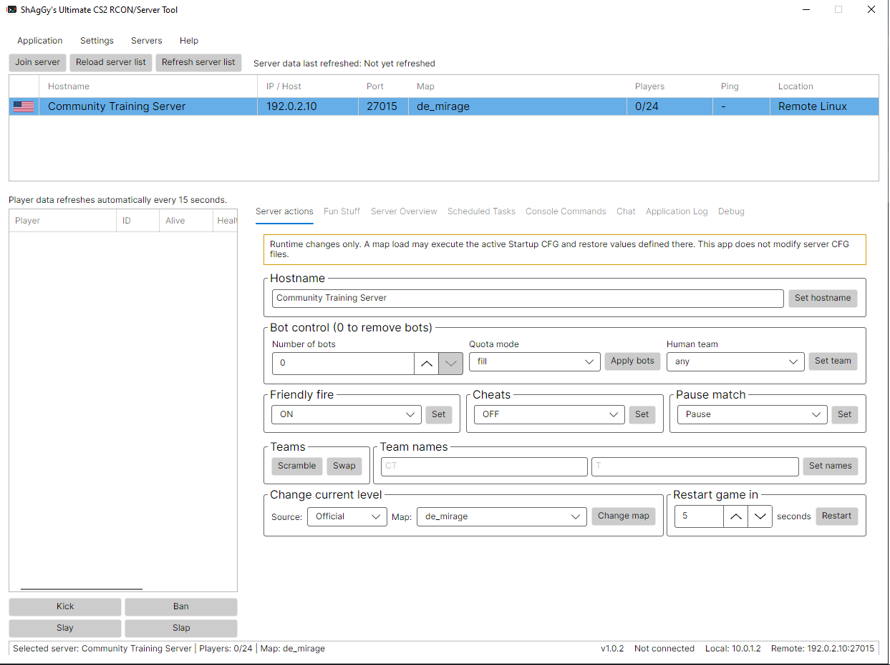
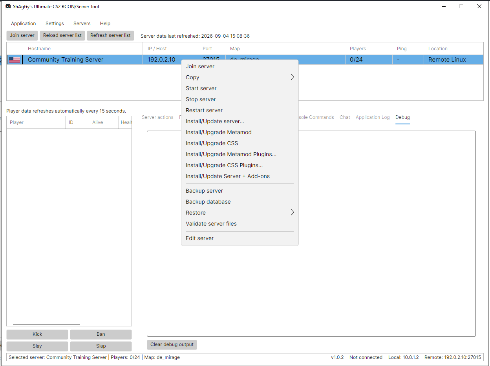
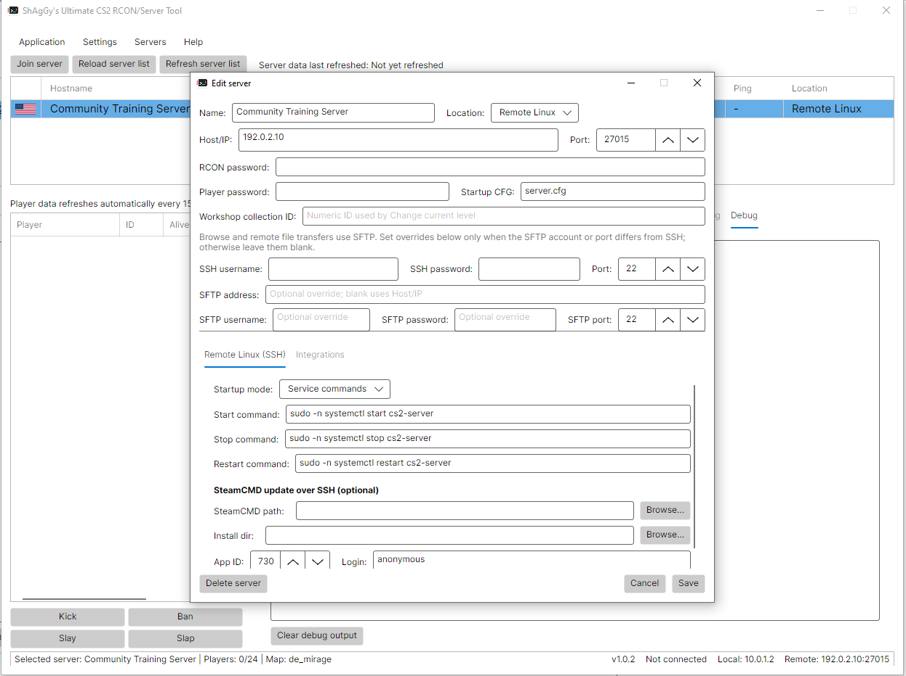
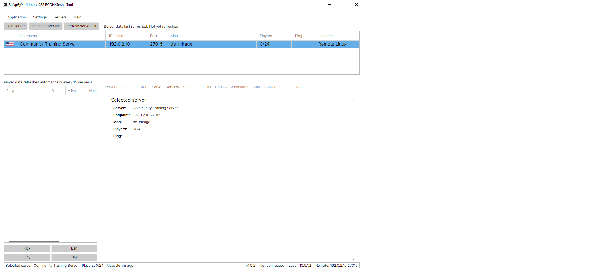
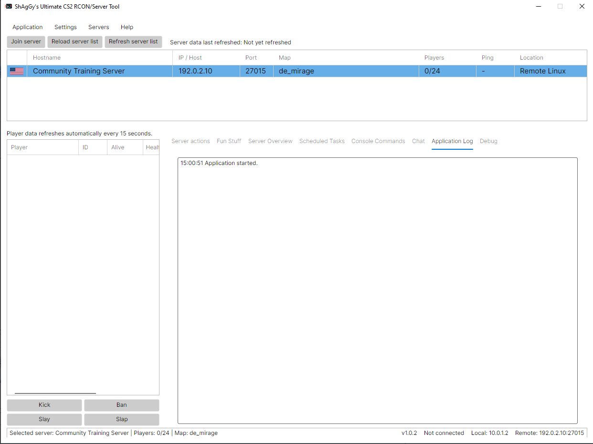

# Ultimate CS2 RCON and Server Management Tool

Version: 1.0.4

Developer: ShAgGy

ShAgGy's Ultimate CS2 RCON and Server Management Tool is a cross-platform desktop application for administering Counter-Strike 2 dedicated servers. It provides RCON commands, local and remote lifecycle management, SteamCMD maintenance, add-on installation, scheduling, backups, player monitoring, and authenticated chat integration from one shared Avalonia application.

## Choose Your Platform

Each platform guide keeps launch, update, profile, Direct process, and Service commands instructions together.

| Application package | Guide | Local CS2 hosting | Remote targets |
| --- | --- | --- | --- |
| Windows x64 | [Windows guide](README-WINDOWS.md) | Local Windows | Linux and Windows |
| Linux x64 | [Linux guide](README-LINUX.md) | Local Linux | Linux and Windows |
| macOS Intel or Apple Silicon | [macOS guide](README-MACOS.md) | Not supported by Valve | Linux and Windows |

macOS 12.0 or later is required. Remote Linux and Remote Windows management use SSH/SFTP; Remote Windows does not require WinRM.

## Release Packages

- `cs2-rcon-tool-universal-v1.0.4-windows-x64.zip`
- `cs2-rcon-tool-universal-v1.0.4-linux-x64.tar.gz`
- `cs2-rcon-tool-universal-v1.0.4-macos-x64.zip`
- `cs2-rcon-tool-universal-v1.0.4-macos-arm64.zip`
- `cs2-rcon-tool-universal-v1.0.4-all-platforms.zip`

Each platform build contains a self-contained, single-file native application. A separate .NET installation is not required. GeoLite data and flag images remain external runtime assets by design.

## Features

- Query CS2 server information and connected players.
- Run categorized RCON commands with suggestions and autocomplete.
- Start, stop, restart, install, update, and validate supported servers.
- Manage local servers on Windows and Linux.
- Manage remote Linux and Windows servers over SSH.
- Choose Direct process or Service commands lifecycle ownership.
- Configure startup maps, Workshop content, CFG, player passwords, tickrate, VAC, and LAN mode.
- Install or upgrade Metamod, CounterStrikeSharp, and tracked optional plugins.
- Apply Fun Stuff modes with exact per-server rollback.
- Back up and restore server files and MySQL/MariaDB databases.
- Schedule RCON and maintenance operations using built-in or native schedulers.
- Receive authenticated game chat from the separate ChatRelay plugin over UDP.
- Maintain GeoLite country information and a 195-country flag set.

## Quick Start

1. Download and extract the package for your operating system.
2. Follow the matching [Windows](README-WINDOWS.md), [Linux](README-LINUX.md), or [macOS](README-MACOS.md) launch instructions.
3. Open **Servers > Manage servers**.
4. Add a server and enter its name, host/IP, game/RCON port, RCON password, and location.
5. Complete lifecycle and SteamCMD settings when the application will manage those operations.
6. Save the profile, select it in the top server list, and click **Refresh server list**.

RCON uses TCP. The configured RCON port must be reachable from the computer running the application; opening only the UDP game port is not sufficient.

## Lifecycle Modes

Every supported local or remote profile separates two ownership models:

- **Direct process**: the application builds the launch arguments and owns the CS2 process. Tickrate, VAC, LAN mode, startup map, CFG, credentials, and related launch settings come from the profile.
- **Service commands**: an existing systemd service or Windows service wrapper owns CS2. The application executes configured Start, Stop, and Restart commands but does not install the service. Launch arguments belong in the service configuration.

Stop the current owner before switching modes. Direct process and Service commands must never manage the same executable and port simultaneously.

Detailed setup:

- [Local and Remote Windows lifecycle](README-WINDOWS.md)
- [Local and Remote Linux lifecycle](README-LINUX.md)
- [Remote management from macOS](README-MACOS.md)

## Server Installation And Updates

Right-click a configured server and select **Install/Update server...**.

- Local Windows can download and run Windows SteamCMD.
- Local Linux can check prerequisites and download Linux SteamCMD.
- Remote Linux and Remote Windows run configured SteamCMD operations over SSH.
- Use App ID `730`.

**Validate server files** and **Install/Update Server** perform explicit SteamCMD validation. Ordinary Restart skips validation so routine restarts do not become lengthy updates. Direct-process local Start validates when SteamCMD and install-directory settings are configured; Service commands defer maintenance to explicit operations.

**Install/Update Server + Add-ons** combines a server update with supported framework and tracked-plugin maintenance.

## Main Areas

### Server List And Actions

The top list displays hostname, address, port, map, players, ping, location, and country. Its context menu provides lifecycle, installation, add-on, backup, restore, validation, copy, and edit operations.

Server Actions control hostname, bots, teams, passwords, friendly fire, cheats, pause, map changes, maximum rounds, timed restarts, and player punishments. These controls send runtime commands and do not edit server CFG files. Configure the Startup CFG and player connection password in the server profile.

### PlayerPunishments

The Slay and Slap controls send `css_slay #userid` and `css_slap #userid damage`. Install [PlayerPunishments 1.0.0 or newer](https://github.com/ShAgGy2035/PlayerPunishments) when the server's existing administration package does not provide those commands. The player table's Alive and Health values also depend on the required server-side player-information command and display **Unknown** when it is unavailable.

Configure Slap damage from `0` to `99` under **Settings > General**. PlayerPunishments is installed on the managed CS2 server as a CounterStrikeSharp plugin, not beside the desktop application.

### Joining A Server

Select a server and click **Join server**. Windows uses the registered Steam URI handler, Linux tries Steam and desktop URI handlers, and macOS uses `open`. If CS2 opens without connecting, paste the copied `connect IP:port` command into the CS2 developer console.

### Fun Stuff

Modes include AWP/Sniper Wars, Bhop, Deathmatch, Grenade Wars, Molotov/Incendiary Wars, Headshot Only, Knife Arena, Pistols Only, ScoutzKnives, Surf, and Zeus Wars. Modes support bot controls and capture the selected server's affected values before applying changes. Switching modes restores the previous state first; **None (rollback)** restores the exact captured values. No server CFG is edited or executed.

All modes require the current [RCON Tool Companion 1.0.1 build](https://github.com/ShAgGy2035/RconCompanionTool), targeting CounterStrikeSharp API 1.0.374. Install the complete MenuManagerAPI 1.0.3 release before Companion. Administrators with `@css/fun` can use `!fun` or `/fun` in game.

### Scheduled Tasks

Task types include RCON commands, framework/plugin maintenance, server backups, database backups, and GeoLite/flag updates. The built-in scheduler runs while the application is open and monitoring is active. Native external tasks use Windows Task Scheduler, systemd user timers, or launchd user agents.

### Console, Logs, And Chat

Console Commands accepts free-form RCON commands and provides categorized suggestions. Each server has separate bounded history. Application Log reports normal operations and failures; Debug provides detailed diagnostics. Passwords, credentials, API keys, and tokens are redacted from console history, logs, and debug output.

The Chat tab receives authenticated JSON messages from the separate [ChatRelay](https://github.com/ShAgGy2035/ChatRelay) CounterStrikeSharp plugin over UDP. Configure the receiving adapter and port, set a unique token under **Edit server > Integrations**, then use **Copy ChatRelay target JSON**. Restrict firewall access to the game server or trusted LAN, or use a VPN.

## Settings

Open **Settings > Settings** for application-wide options. The **General** tab includes GeoLite and country-flag URLs, slap damage, automatic 15-second server-list refresh, noisy-output filtering, and GeoLite/flag updates. The **Backups** tab provides separate destinations for server-file and database backups.

Server-specific lifecycle, SteamCMD, map, RCON, player-password, database, ChatRelay, Steam authentication, and backup credentials remain under **Servers > Manage servers > Edit server**.

## Frameworks And Plugins

Install Metamod before CounterStrikeSharp. Interactive installation shows the latest 20 compatible releases and accepts a selected release or direct HTTP(S) package URL. Scheduled and headless maintenance use the newest compatible releases because they cannot display selection dialogs.

Optional plugins can come from GitHub, a public GitLab.com project, or a supported local archive or library. The installer filters assets by server OS and tracks installed files per server in:

```text
game/csgo/.cs2-rcon-tool-plugins.json
```

Keep this ownership manifest with the server. It allows uninstall to remove owned files while preserving shared files, configuration, and framework files.

## Backups And Restore

- **Backup server** archives configuration, add-ons, maps, `gameinfo.gi`, and plugin tracking instead of stock CS2 binaries or Workshop downloads.
- **Backup database** runs `mysqldump` using the selected server's integration settings.
- **Restore server backup...** validates and restores ZIP, TAR.GZ, or TGZ content, stopping and restarting the server as needed.
- **Install/update + restore server backup...** updates core files before restoring a backup.
- **Restore database backup...** imports SQL using the configured MySQL client.

Remote operations require appropriate SSH permissions and archive tools on the managed host.

## Data Storage And Security

Writable data is stored per user, not beside the executable:

- Windows: `%APPDATA%\CS2RconTool`
- Linux: typically `~/.config/CS2RconTool`
- macOS: typically `~/Library/Application Support/CS2RconTool`

The directory contains:

- `servers.json`: profiles and protected credentials.
- `tasks.json`: scheduled tasks and protected credentials.
- `steam_settings.json`: application settings and protected tokens.
- `fun_stuff_state.json`: per-server Fun Stuff state without credentials.
- `credential.key`: the per-user AES key.
- `GeoLite2-Country.mmdb` and `flags/`: writable GeoIP assets.

Saved secrets use AES-256-GCM. Protect `credential.key` as carefully as the JSON files. Release archives intentionally exclude settings, keys, caches, PDB files, ChatRelay binaries, and Companion binaries.

## Updating Or Migrating Data

Close the application before updating. Replace application files or extract the new package to a new folder; on macOS, replace the entire app bundle. Back up the complete per-user `CS2RconTool` directory first.

For migration:

1. Open the new application once, then close it.
2. Back up its generated per-user data directory.
3. Copy `servers.json`, `tasks.json`, `steam_settings.json`, and `fun_stuff_state.json` from the old installation.
4. Copy the matching old `credential.key` when available.
5. Reopen the application.

Configuration can load when protected credentials cannot be decrypted, but affected RCON, SSH, database, ChatRelay, Steam API, and GSLT values must be re-entered and saved.

Remote profiles remain portable when valid credentials and target paths are supplied. Local profiles must match the operating system running the application; macOS cannot run local CS2 profiles.

## Troubleshooting

- Re-enter and save RCON or SSH credentials after migration.
- Verify the host/IP and RCON TCP port.
- Confirm firewalls permit the game UDP port and RCON TCP port.
- Check Application Log and Debug for lifecycle, SteamCMD, SSH, and RCON details.
- Do not run Direct process and Service commands against the same executable and port.
- Install or validate Metamod before CounterStrikeSharp when framework commands are unknown.
- Use **Settings > General > Update GeoLite + flags** when country data is missing.
- Confirm built-in scheduler monitoring is active or inspect the platform's native scheduler when tasks do not run.

Platform-specific diagnostics:

- [Windows troubleshooting](README-WINDOWS.md#troubleshooting)
- [Linux troubleshooting](README-LINUX.md#troubleshooting)
- [macOS troubleshooting](README-MACOS.md#troubleshooting)

## Application Screenshots

| Server actions | Server context menu |
| --- | --- |
|  |  |
| Manage servers | Edit a Remote Linux server |
|  |  |
| Fun Stuff modes | Server overview |
|  |  |
| Scheduled tasks | Console commands |
|  |  |
| Chat | Application log |
|  |  |

## Issues

Report application issues at https://github.com/ShAgGy2035/Ultimate-RCON-Server-Tool/issues/new.

Open **Help > About** to view the application version, developer information, and detected platform.
